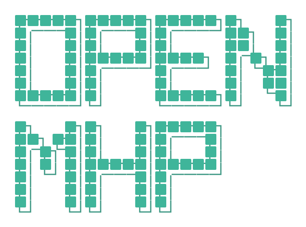
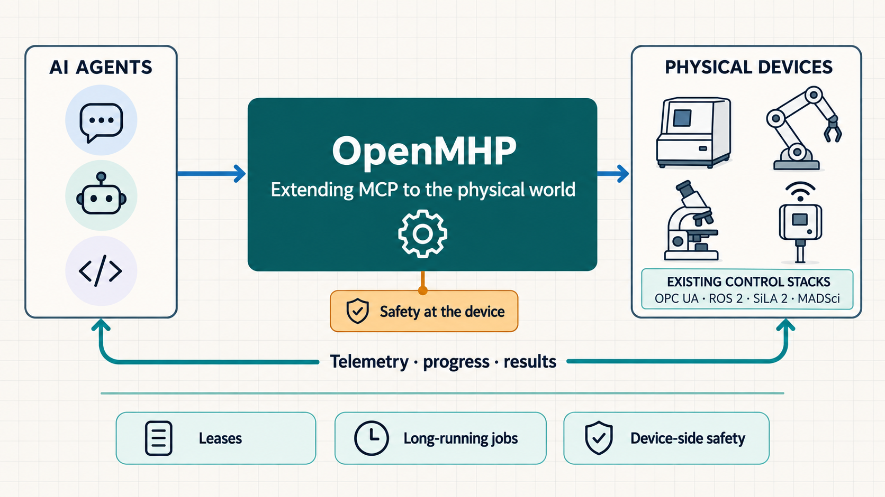

<div align="center">

<picture>
  <source media="(prefers-color-scheme: dark)" srcset="assets/hero-dark.svg">
  
</picture>

### Give AI agents a safe, shared interface to physical devices

OpenMHP is an open protocol for discovering, understanding, and operating lab instruments,
robots, and industrial equipment. MCP connects an agent to a software tool for a request and
response. OpenMHP extends that model for physical work that may run for minutes, hours, or days.

[](https://www.npmjs.com/package/openmhp-cli)
[](https://www.npmjs.com/package/openmhp-node)
[](https://pypi.org/project/openmhp/)
[](LICENSE)
[](https://openmhp.com)

[Quickstart](https://openmhp.com/quickstart) · [Design](https://openmhp.com/design) · [Architecture](https://openmhp.com/architecture) · [Roadmap](https://openmhp.com/roadmap) · [Specification](SPEC.md) · [Contributing](CONTRIBUTING.md)

</div>

> **MCP calls a tool. OpenMHP stays with the machine.**
>
> An OpenMHP operation acquires a lease on the device, starts a durable job, and listens for
> telemetry, progress, results, and safety events until the work is complete. The agent can
> leave and return without losing the state of the physical process.

```text
MCP:      request ──────────────────────────────────────────────► response
OpenMHP:  lease ─► job ─► live telemetry and events ─► result ─► release
```



## Why OpenMHP?

Connecting an AI agent to a database or ticketing system is mostly an API problem: send a
request and receive data. Connecting one to a centrifuge, robot arm, microscope, or PLC is a
long-horizon coordination problem:

- physical work lasts minutes or hours, well beyond one tool call;
- instruments produce telemetry, progress, files, and safety events while they run;
- the useful operating knowledge lives in manuals, SOPs, and experienced operators;
- a malformed request can waste a sample or move real hardware; and
- every vendor exposes a different control surface.

OpenMHP gives these devices a common agent-facing layer without replacing the control systems
already underneath them. The job records what the instrument is doing, the lease prevents a
second agent from interleaving commands, and the event stream keeps the agent informed without
making it continuously poll the device.

The design follows a few rules:

- **Use jobs for long-running work.** An action returns immediately; progress, results, and
  files remain available even if the agent leaves and comes back.
- **Push observations.** Signal changes, job progress, completion, and safety events flow back
  to the bridge rather than forcing the agent into a polling loop.
- **Load context progressively.** Agents first see a small card, then instructions and exact
  capabilities only for the device they select.
- **Keep safety at the edge.** The server beside the instrument checks state, approvals,
  interlocks, typed parameters, leases, and busy state before calling vendor code.
- **Wrap what the lab already has.** OpenMHP is an agent-facing layer over existing drivers and
  control systems, not a replacement for them.

An agent may propose an action. The device server decides whether it is allowed to run.
OpenMHP complements hardwired e-stops, light curtains, PLC safety logic, and normal lab
procedures; it does not replace them.

## Try it in five minutes

You need Node.js 18+ and Python 3.10+.

### 1. Install OpenMHP

Open Claude Code or Codex and ask your agent:

```text
Install OpenMHP for me by running `npx openmhp-cli setup`, then tell me when it is ready.
```

The agent will run:

```bash
npx openmhp-cli setup
```

The launcher installs an isolated runtime under `~/.openmhp`, installs the bundled Agent
Skills, and registers the MCP server with Claude Code and Codex. Restart the agent after setup
if it does not immediately show the OpenMHP tools.

For another MCP client, use:

```json
{
  "mcpServers": {
    "openmhp": {
      "command": "npx",
      "args": ["-y", "openmhp-cli"]
    }
  }
}
```

Prefer Python directly? Install the runtime with:

```bash
pip install "openmhp[all]"
```

### 2. Add the simulated lab

```bash
npx openmhp-cli demo
npx openmhp-cli list
```

This adds a simulated thermocycler and plate-handling arm. They use the same discovery,
description, safety, job, and event paths as real devices.

### 3. Ask your agent to do something concrete

```text
Find a thermocycler, show me its operating instructions, and rehearse a
3-cycle PCR at 95/58/72 °C before running it.
```

The normal operating loop is:

1. **Find** a suitable device from a plain-language request.
2. **Describe** it and read the owner's operating procedure.
3. **Check** live signals and interlocks.
4. **Plan** or dry-run the procedure through its safety gates.
5. **Run** it as a job and follow progress or pushed events.
6. **Verify** the result from measurements, not from the requested setpoint.

Try asking for a 200 °C thermocycler setpoint. The driver should refuse it and return the
allowed range.

## What using it looks like

Talk to the agent in terms of the work you want done:

| You ask | OpenMHP does |
|---|---|
| “Find the instruments on my network.” | Scans mDNS and known hosts for OpenMHP devices and returns compact device cards. |
| “Onboard my hotplate.” | Interviews the owner, writes and validates a device package, and produces a safety card for review. |
| “Run a 30-cycle PCR and hold at 4 °C.” | Finds a compatible device or recipe, rehearses the procedure, runs it as a job, and reports measured results. |
| “Watch the incubator overnight.” | Runs a background monitor and stores readings and alerts with the run. |
| “Which GC method should I use for ethanol?” | Searches versioned methods associated with the device and project. |
| “Stop everything now.” | Requests e-stop for every device touched by the session. |

You can use the same protocol without an agent:

```bash
mhp http://localhost:18921 describe summary
mhp http://localhost:18921 read block_temperature lid_closed
mhp http://localhost:18921 write target_temperature 95 --dry-run
mhp http://localhost:18921 invoke run_protocol \
  '{"steps":[{"temp":95,"hold_s":5}],"cycles":3}' --wait
mhp http://localhost:18921 estop "operator requested stop"
```

## How it works

An OpenMHP deployment has three parts:

1. **Device package** — a card, operating instructions, machine-readable descriptor,
   references, scripts, and a driver or adapter.
2. **Device server or lab node** — runs beside the instrument, translates OpenMHP calls into
   the native control API, publishes events, and enforces the device boundary.
3. **MCP bridge** — gives an agent a fixed set of OpenMHP tools regardless of whether the lab
   has two devices or two thousand.

```text
agent harness
    │
    │ MCP: find, describe, read, write, invoke, job, run, data, lab, method, estop
    ▼
OpenMHP bridge ───── directory of compact device cards
    │
    │ MHP over stdio or HTTP/SSE
    ▼
device server / lab node
    │
    │ vendor SDK, serial, OPC UA, ROS 2, SiLA 2, MQTT, ...
    ▼
physical instrument
```

### Built to bridge the automation stack you already have

Labs have invested years in control systems such as **ROS 2, OPC UA, SiLA 2, MADSci,
PyLabRobot, and MQTT**. OpenMHP does not ask them to replace that work. It adds a common
agent-facing layer above it:

- OPC UA variables and methods become OpenMHP signals, settings, and actions.
- ROS 2 topics, services, and actions keep their native feedback and control paths.
- SiLA 2 properties and commands retain observable progress and cancellation.
- MADSci nodes expose their existing actions, status, and safety controls.
- PyLabRobot machines expose their existing operations through the same job model.
- MQTT topics connect existing telemetry and command channels to the device model.

The adapter translates each technology into the same discovery, job, lease, telemetry, and
safety contract. The agent gets one way to interact with the lab while the lab keeps its
existing drivers, orchestration, and operational knowledge. See the
[adapter guide](https://openmhp.com/adapters) for the supported mappings.

Read the rationale in the [design principles](https://openmhp.com/design), see the components
in the [architecture guide](https://openmhp.com/architecture), and use [SPEC.md](SPEC.md) as the
normative protocol contract.

## Connect a real instrument

Start with the route that matches the hardware:

| Instrument today | Recommended route |
|---|---|
| Already exposes OpenMHP | Scan and add its URL |
| Operated by a person | Use the manual driver so it can join procedures while preserving operator steps |
| Uses serial/USB text commands | Declare the commands in `descriptor.yaml`; no custom protocol code is needed |
| Already uses OPC UA, ROS 2, SiLA 2, MADSci, PyLabRobot, or MQTT | Use the matching adapter |
| Has a vendor Python SDK or another API | Subclass `Driver` or bind existing Python callables with `BoundDriver` |

From an agent, say:

```text
Onboard my IKA hotplate. I have the manual and can confirm its limits and stop procedure.
```

To serve packages from the bench computer attached to the instruments:

```bash
npx openmhp-node setup
```

Or use Python directly:

```bash
mhp node ~/instruments --http 18900
mhp node ~/instruments --http 18900 --install-service
```

Before real operation, have the instrument owner review `DEVICE.md`, verify limits and
interlocks against the manual, prove out-of-range requests are refused, test e-stop and loss of
contact behavior, and keep the manufacturer's safety systems in place. OpenMHP is currently an
experimental preview tested primarily with simulators and fake vendor clients; supervise real
hardware deployments.

The full walkthrough is [Add an instrument](https://openmhp.com/add-a-device). For a lab with
many existing devices, see [Adapters](https://openmhp.com/adapters) and
[Lab nodes](https://openmhp.com/lab-nodes).

## Device packages

A package contains what an agent needs to choose and operate one device:

```text
devices/hotplate-01/
├── DEVICE.md          searchable card + operating instructions
├── descriptor.yaml    signals, settings, actions, limits, interlocks, safety
├── driver.py          native driver, BoundDriver, or adapter
├── sim.py             simulated twin (recommended)
├── references/        SOPs, manual excerpts, calibration notes
├── scripts/           tested end-to-end procedures
└── methods/           optional versioned methods for named procedures
```

`DEVICE.md` is deliberately readable by both people and agents. `descriptor.yaml` contains the
parts the runtime can enforce. A typical driver only implements the hardware-specific hooks;
the base driver supplies the common protocol, job handling, notifications, and safety gates.

Device packages and recipes normally belong to the lab that owns the instruments and operating
procedures. Keep them in your lab's own repository, review limit changes like code, and deploy
them to the bench computers that serve those devices. The packages in
[`openmhp/devices`](openmhp/devices) and [`packages`](packages) are reference examples for
learning and testing the protocol.

## Contributing

OpenMHP is developed like a protocol project. Contributions should make the protocol clearer,
more interoperable, easier to implement, or better tested. Lab-specific device packages,
private SOPs, and recipes usually belong in the lab's own repository rather than upstream.

Useful contributions include:

- proposals that resolve an open protocol or architecture question;
- work on items in the [published roadmap](https://openmhp.com/roadmap);
- improvements to the reference server, client, MCP bridge, discovery, jobs, events, leases,
  or safety behavior;
- adapter and interoperability improvements for ROS 2, OPC UA, SiLA 2, MADSci, PyLabRobot,
  MQTT, and other established automation systems;
- conformance tests that help independent OpenMHP implementations agree on behavior; and
- documentation, examples, and security reviews that make the protocol easier to implement
  correctly.

Before starting a substantial change, open an issue describing the protocol problem, the
affected implementations, and the behavior you propose. This gives the design discussion a
place to happen before code fixes one interpretation into the reference implementation.

### Set up a development checkout

```bash
git clone https://github.com/kushalsinha/openmhp.git
cd openmhp
python -m venv .venv
source .venv/bin/activate          # Windows: .venv\Scripts\activate
pip install -e ".[all]"
```

Run the test suite:

```bash
python tests/test_adapters.py
python tests/test_runs.py
python tests/test_safety_gates.py
python tests/test_methods.py
```

### Contribution principles

- Start from a protocol or interoperability need, not a one-off lab customization.
- Keep the specification, reference implementation, and conformance tests aligned.
- Fail closed when hardware state or command outcome is uncertain.
- Preserve the fixed, device-independent tool surface.
- Add regression coverage for changes to safety, state, concurrency, or transport behavior.
- Document compatibility expectations for every adapter or wire-level change.

Read [CONTRIBUTING.md](CONTRIBUTING.md) for proposal and pull-request expectations. Protocol
questions, roadmap work, interoperability gaps, bugs, and design proposals belong in
[GitHub Issues](https://github.com/kushalsinha/openmhp/issues).

## Repository guide

| Path | Purpose |
|---|---|
| `openmhp/driver.py` | Driver base class, state machine, jobs, safety gates, and notifications |
| `openmhp/package.py` | Device-package loading and progressive description tiers |
| `openmhp/mcp_bridge.py` | Fixed MCP tool surface over a lab or directory |
| `openmhp/client.py` | Python client and multi-device `Lab` API |
| `openmhp/runs.py` | Plans, background runs, logs, and run artifacts |
| `openmhp/methods.py` | Versioned instrument methods and project history |
| `openmhp/adapters/` | OPC UA, ROS 2, SiLA 2, MADSci, PyLabRobot, MQTT, and callable bindings |
| `openmhp/devices/` | Bundled reference devices and simulated twins |
| `openmhp/recipes/` | Reusable multi-step procedures |
| `packages/` | Reference device packages used as implementation examples |
| `tests/` | Simulator and fake-client coverage |

## Project status

OpenMHP is a pre-1.0 experimental protocol. Expect breaking changes between minor versions.
The [roadmap](https://openmhp.com/roadmap) tracks what is implemented and what remains out of
scope. Use real hardware only with qualified supervision and independent safety controls.

## License

Apache License 2.0. See [LICENSE](LICENSE).

OpenMHP is an independent, community-driven project. It is not affiliated with, endorsed by,
or sponsored by Anthropic, the OPC Foundation, Open Robotics, the SiLA Consortium, MADSci,
PyLabRobot, or any instrument vendor. Names are used only to describe compatibility.
